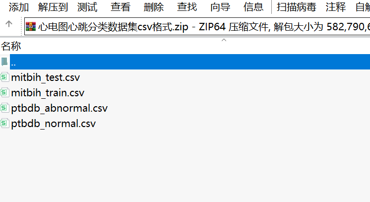

# ECG Heartbeat Classification Dataset in CSV Format.zip

Dataset Introduction  
The dataset consists of two sets of heartbeat signals from the renowned MIT-BIH Arrhythmia and PTB Diagnosis Electrocardiogram (ECG) databases. The number of samples in both datasets is sufficient for training deep neural networks. This dataset has been used to explore the ability of deep neural network architectures for heartbeat classification and observe some transfer learning capabilities on it.

For normal cases and those affected by different arrhythmias and myocardial infarction, the signals correspond to the shape of an ECG heartbeat. These signals have undergone preprocessing and segmentation, with each segment corresponding to a beat.

Data Annotations  
MIT-BIH Arrhythmia Dataset  
Samples: 109446  
Number of classes: 5  
Sampling frequency: 125Hz  
Source: Physionet's MIT-BIH Arrhythmia Dataset  
Classes: ['N': 0, 'S': 1, 'V': 2, 'F': 3, 'Q': 4]  
PTB Diagnosis Electrocardiogram Database  
Samples: 14552  
Number of classes: 2  
Sampling frequency: 125Hz  
Source: Physionet's PTB Diagnosis Database  
Note: All samples were cropped, downsampled, and padded with zeros to a fixed dimension of 188 where necessary.

Data Files  
The dataset consists of a series of CSV files. Each CSV file contains a matrix, with each row representing an example from that part of the dataset. The last element of each row indicates which class the example belongs to.

Acknowledgments  
Mohammad Kachuee, Shayan Fazeli, and Majid Sarrafzadeh. "ECG Heartbeat Classification: A Deeply Transferable Representation."arXiv preprint arXiv:1805.00794 (2018).

## Images

Here is a pay link on Stripe ( https://buy.stripe.com/3cs8yP7sY87d0vu9AB ). Please contact me lonlonago@foxmail.com after funding $89, and I will send you a complete data files , thank you!

